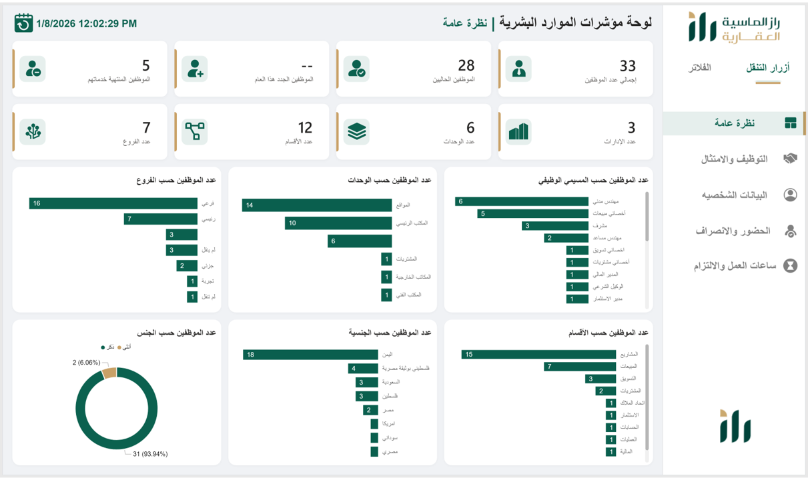
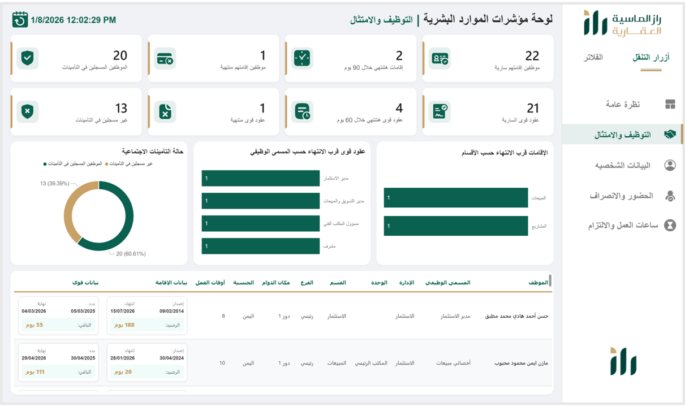
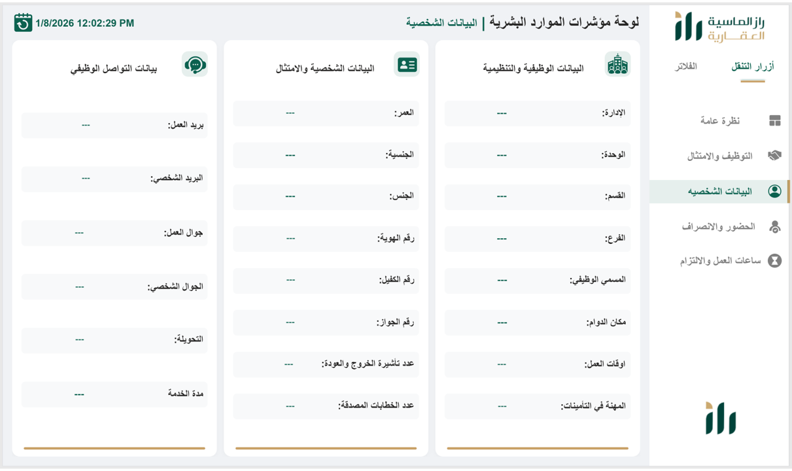
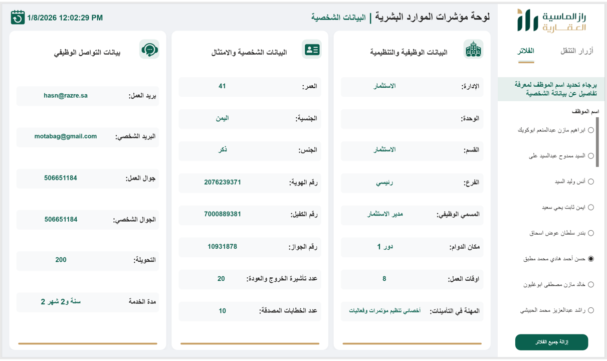
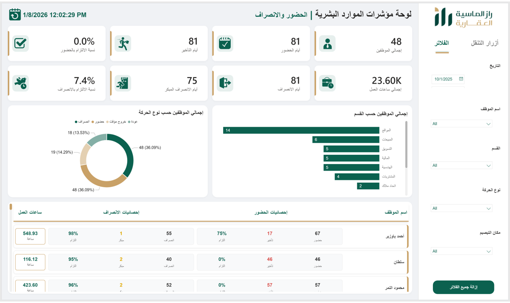
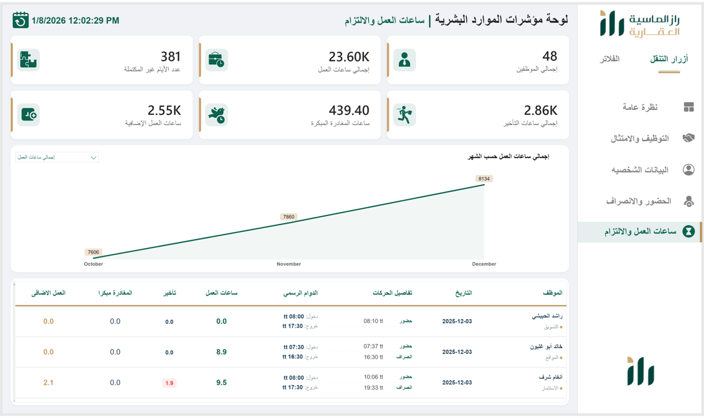

# 📊 HR Analytics Dashboard - راز الماسية العقارية

## 🏢 Overview
This project presents a comprehensive **HR Analytics Dashboard** developed for **زاز الماسية العقارية**.

The dashboard is built using **Power BI** and focuses on:
- Workforce insights  
- Attendance & compliance  
- Working hours analysis  
- Employee profiling  

# 🌐 Live Dashboard

You can explore the interactive dashboard through the live link below:

🔗 **Open the Live Dashboard**  
[Click here to view the dashboard](https://app.powerbi.com/view?r=eyJrIjoiYzJkMDU3MjktNWUwZS00OWQxLTg4ZTMtMTRjYzAyZjNmY2FmIiwidCI6IjJiYjZlNWJjLWMxMDktNDdmYi05NDMzLWMxYzZmNGZhMzNmZiIsImMiOjl9&pageName=f272c68214863291e034)

---

## 🖼️ Dashboard Pages

---

---

### 1. Home Page

---

### 📌 2. General Overview (نظرة عامة)

**🎯 الهدف:**
عرض نظرة شاملة وسريعة عن حالة الشركة من حيث:
- عدد الموظفين الحاليين  
- الموظفين الجدد  
- المنتهية خدماتهم  
- الهيكل التنظيمي  

---

### 📌 3. Recruitment & Compliance (التوظيف والامتثال)

**🎯 الهدف:**
متابعة التزام الشركة بالأنظمة الحكومية والموارد البشرية:

- حالة الإقامات (سارية / منتهية / قريبة الانتهاء)  
- عقود قوى  
- التأمينات  
- المخاطر المتعلقة بالامتثال  

---

### 📌 4. Employee Profile (البيانات الشخصية)

- **عند تحديد اسم الموظف سيظهر لك تفاصيل بياناته**

**🎯 الهدف:**
عرض بيانات تفصيلية لكل موظف مقسمة إلى:

- البيانات الوظيفية والتنظيمية  
- البيانات الشخصية والامتثال  
- بيانات التواصل  

📌 يساعد في الوصول السريع لأي معلومة عن الموظف.

---

### 📌 5. Attendance & Tracking (الحضور والانصراف)

**🎯 الهدف:**
تحليل سلوك الحضور والانصراف:

- إجمالي الحضور والانصراف  
- عدد المتأخرين  
- الانصراف المبكر  
- نسبة الالتزام  

📊 يساعد في تقييم الانضباط الوظيفي.

---

### 📌 6. Work Hours & Commitment (ساعات العمل والالتزام)

**🎯 الهدف:**
تحليل أداء الوقت داخل الشركة:

- إجمالي ساعات العمل  
- ساعات التأخير  
- ساعات الانصراف المبكر  
- ساعات العمل الإضافية  
- الأيام غير المكتملة  

📈 يوفر رؤية دقيقة عن الإنتاجية والالتزام.

---

## ⚙️ Tools & Technologies
- Power BI  
- DAX  
- Data Modeling  
- Google Sheets (Data Source)  

---

## 📌 Key Features
- Dynamic KPIs  
- Field Parameters (Dynamic Measures)  
- Smart Calculations (Attendance Logic)  
- Clean UI/UX Design  
- Arabic Business-Oriented Dashboard  

---

## 🚀 Project Value
هذا المشروع يساعد الإدارة في:
- تحسين كفاءة الموظفين  
- تقليل المخاطر القانونية  
- متابعة الأداء اليومي  
- اتخاذ قرارات مبنية على البيانات  

---

## 👨‍💻 Developed By
**Ahmed Mohamed**  
Data Analyst | Business Analyst  

---

## ⭐ If you like this project
Give it a ⭐ on GitHub!